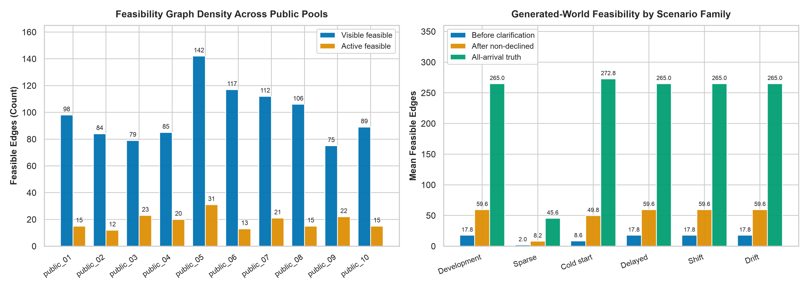
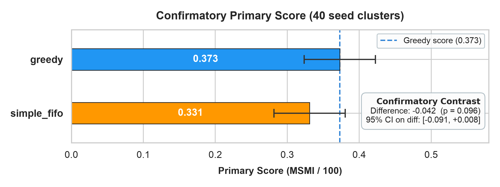
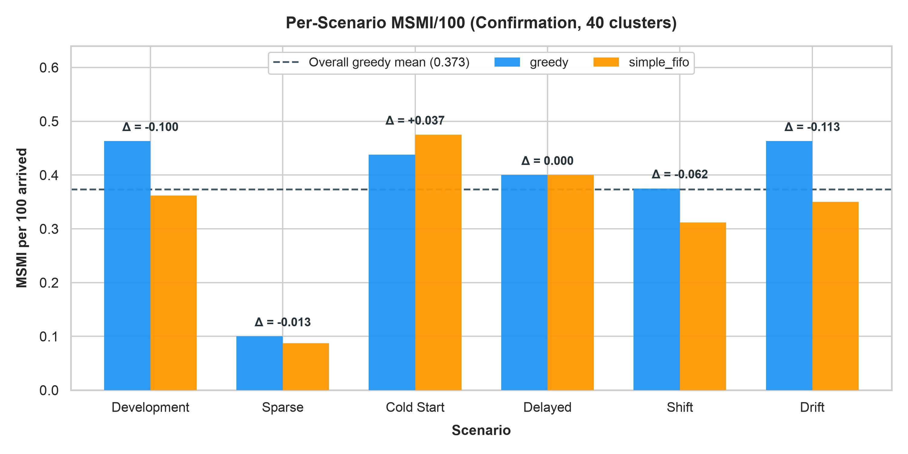
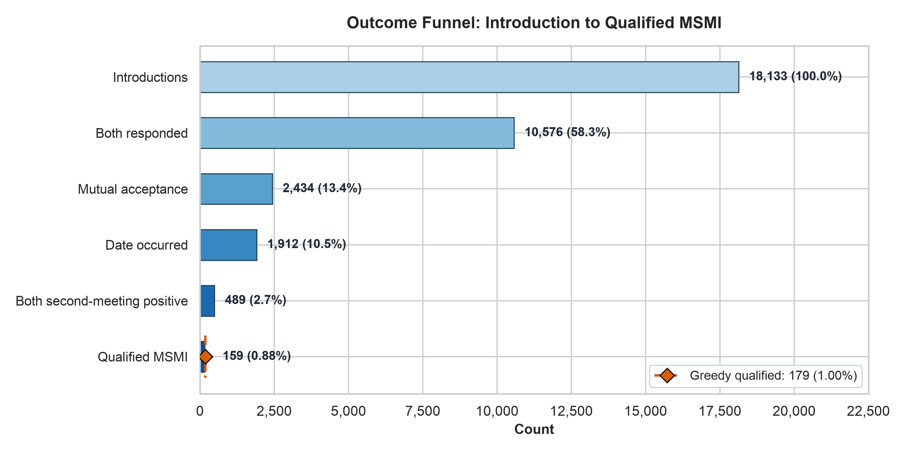
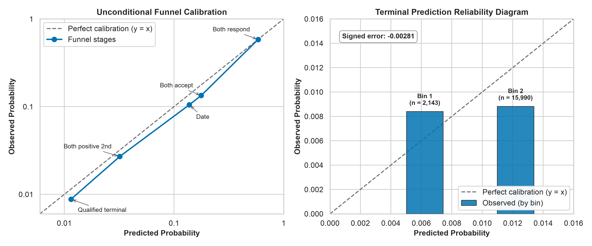
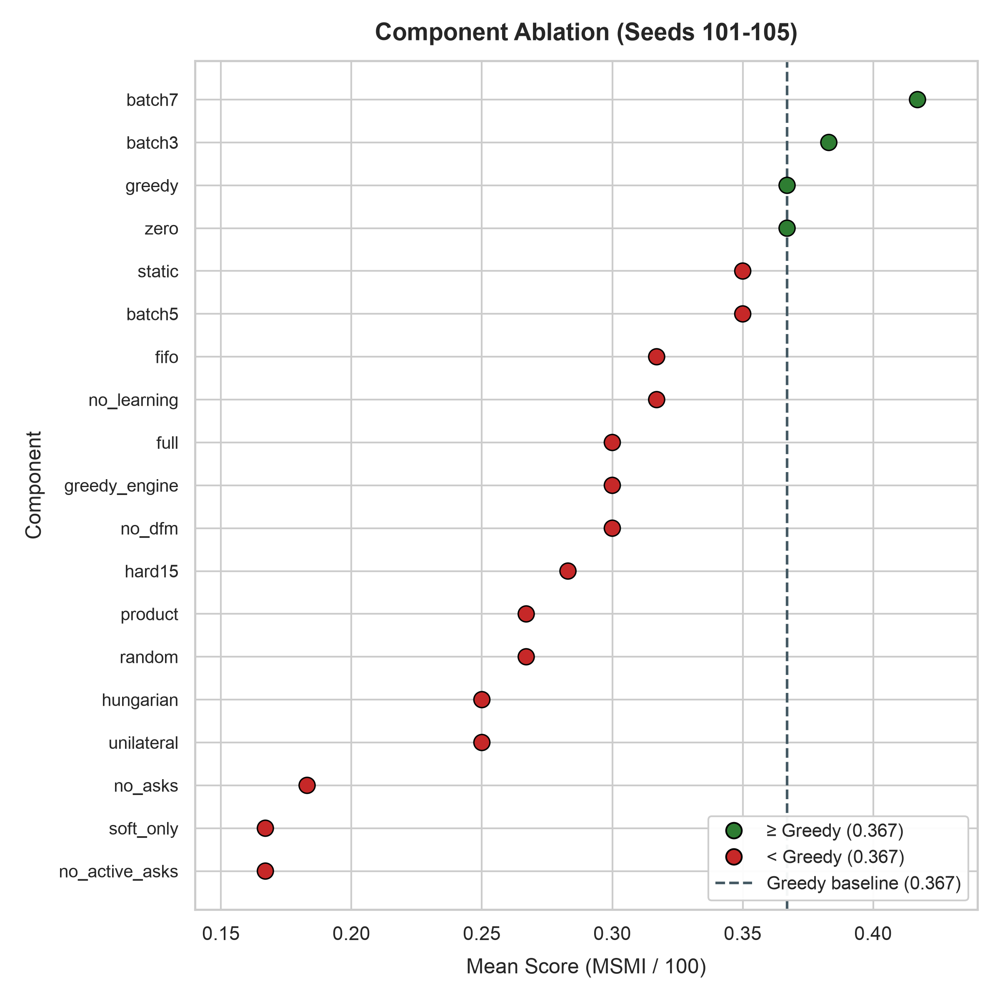

# Round 1 Research Submission: Sequential Reciprocal Matching with Targeted Clarification

**Release:** Public synthetic release 1.0.0
**Evaluation scale:** 2,040 episodes across three experimental stages (development, selection, confirmation)
**Selected candidate:** `simple_fifo`: aggregate terminal probability model with FIFO hard-bundle queries and greedy allocation
**Status:** Confirmatory result is negative; the candidate does not beat the supplied greedy baseline on the primary metric.

---

## 1. Problem Interpretation

The policy operates over 60 decision days followed by 40 follow-up days. On each day it makes two sequential choices:

1. **Clarification**: select which unknown profile fields to ask about, subject to a daily budget of 12 units (hard-constraint bundle: 3 units; named soft-field question: 1 unit).
2. **Allocation**: select a batch of non-overlapping introductions from currently available, reciprocally feasible pairs.

A pair is valid for introduction only when the kit's `eligibility(a, b)` function returns `feasible` in both directions, both members are currently available, the pair has not been previously introduced, and neither member appears more than once in the same batch. The 11 hard constraint fields (age bounds, gender preference, relationship structure, smoking, children, zones, schedule) must all be verified before a pair can be introduced. Missing hard data blocks the pair; soft compatibility scores cannot override hard infeasibility.

The primary objective is mutual second-meeting intention (MSMI) per 100 arrived members, equally weighted across six scenario families: development, sparse geography, cold start, delayed dates, shifted outcome weights, and changing response conditions. MSMI qualifies only when a date occurs within 30 days of introduction and both members submit positive second-meeting responses within 3 days of that date.

The policy uses only the current observable state and its own serialized memory. It does not access future arrivals, hidden simulator traits, private response propensities, or outcomes that have not yet matured through the observation window.

## 2. Research Hypothesis

We investigated whether a structured policy combining (a) official reciprocal feasibility checks, (b) targeted clarification of missing hard constraints, (c) a terminal probability model for scoring candidate pairs, and (d) allocation via maximum-weight matching could improve MSMI over the supplied greedy baseline.

We tested 20 candidate configurations spanning four modular dimensions:
- **Scoring models**: integrated terminal probability, independent marginals, simple aggregate, frozen regime, no-learning, product fusion
- **Clarification strategies**: FIFO ordering, potential-degree ranking, prior-entropy ranking, Monte Carlo matching-value estimation, pairwise two-query lookahead, randomized exploration
- **Allocation solvers**: greedy first-fit, Edmonds' blossom (exact MWM with 500ms timeout), Hungarian bipartite
- **Dynamic adjustments**: opportunity-cost continuation penalties, component batching, adaptive reservation thresholds

The experimental design followed a three-stage registered protocol: 8 development seeds (1,056 episodes) for configuration search, 12 selection seeds (504 episodes) for candidate narrowing, and 40 confirmation seeds (480 episodes) for the pre-registered statistical test.

## 3. Reciprocal Feasibility Analysis

The feasible-pair landscape in this simulator is extremely sparse. A pairwise scan across the 10 public pools shows the following structure:

| Pool | Visible feasible edges | Active feasible edges | Max degree |
|---|---:|---:|---:|
| public_01 | 98 | 15 | 13 |
| public_02 | 84 | 12 | 12 |
| public_03 | 79 | 23 | 9 |
| public_04 | 85 | 20 | 12 |
| public_05 | 142 | 31 | 17 |
| public_06 | 117 | 13 | 15 |
| public_07 | 112 | 21 | 11 |
| public_08 | 106 | 15 | 15 |
| public_09 | 75 | 22 | 8 |
| public_10 | 89 | 15 | 7 |

In generated worlds, the feasibility graph is even more constrained:

| Scenario | Before clarification | After non-declined resolution | All-arrival truth |
|---|---:|---:|---:|
| Development | 17.8 | 59.6 | 265.0 |
| Sparse | 2.0 | 8.2 | 45.6 |
| Cold start | 8.6 | 49.8 | 272.8 |
| Delayed | 17.8 | 59.6 | 265.0 |
| Shift | 17.8 | 59.6 | 265.0 |
| Drift | 17.8 | 59.6 | 265.0 |



Before any clarification, the development scenario has only 17.8 feasible edges on average (out of ~19,900 possible pairs among 200 members). Hard-constraint clarification is the primary bottleneck: resolving non-declined hard fields expands the graph from 17.8 to 59.6 edges. The sparse scenario is structurally limited at every stage, with only 45.6 edges even under complete information. 35% of members decline at least one hard field, permanently blocking those constraint checks.

None of the feasibility graphs are bipartite (the pools include women, men, and non-binary members with varied `who_to_meet` preferences), so general graph matching is required rather than bipartite solvers.

## 4. Proposed Policy Architecture

### 4.1 Terminal Probability Model

The selected candidate (`simple_fifo`) uses a smoothed aggregate terminal probability as the pair scoring function. The terminal probability decomposes the outcome funnel as:

$$\text{terminal} = 0.36 \times h \times d \times k_u k_v \times \mathbb{E}[a_u a_v s_u s_v]$$

where:
- $0.36 = (3/5)^2$ is the probability that both second-meeting feedback responses arrive within the 3-day deadline
- $h = P(\text{date delay} \le 30)$ (1.0 for standard families, $5368/5488 \approx 0.978$ for delayed)
- $d = 0.78$ is the date occurrence probability conditional on mutual acceptance
- $k_u = \mathbb{E}[R_u^2]$ uses the second moment of the response rate under a $U[0.55, 0.98]$ prior
- $a_u, s_u$ are acceptance and second-meeting logistic functions with shared dyadic Gaussian noise $S \sim \mathcal{N}(0, 0.45^2)$

The `simple` model variant uses a mature aggregate terminal probability rather than per-feature discrimination. It waits 38 days before incorporating terminal funnel observations to avoid quick-failure bias. Because the predicted rate is approximately constant across all candidate dyads, edge weights are near-uniform, and matching allocation reduces to greedy in canonical member-ID order.

### 4.2 Clarification Strategy

The policy uses pure FIFO hard-bundle queries: it processes available members with missing, non-declined hard fields in list order, requesting the `constraints` bundle (cost 3) until the daily budget of 12 is exhausted. Under this strategy, at most 4 hard bundles can be requested per day.

A key theoretical finding is the **FIFO Clarification Invariance**: any two policies that execute pure FIFO hard-bundle queries on the same world and budget will experience identical query schedules and cumulative ask costs, regardless of their matching decisions. This is because incomplete members cannot be matched, so their availability depends solely on exogenous arrivals and exits.

The selected candidate does not ask soft-field questions. Development-stage experiments with soft acquisition showed marginal value: the `terminal_soft` configuration, which added decision-changing soft asks, scored 0.510 in development (tied for first) but dropped to 0.278 in the selection stage. Soft questions cost additional budget without reliably improving MSMI.

### 4.3 Allocation Algorithm

The selected candidate uses greedy first-fit allocation: feasible edges are sorted by the terminal probability score, and pairs are greedily selected such that no member appears more than once in the batch. The policy stores introduced pairs in memory to prevent repeats.

We also tested Edmonds' blossom matching (exact maximum-weight general graph matching via NetworkX, with a 500ms SIGALRM timeout and greedy fallback), Hungarian bipartite matching, and component batching. None of these improved MSMI over greedy allocation in the selection or confirmation stages, likely because the feasibility graph is sparse enough that the greedy solution is near-optimal in most episodes.

### 4.4 Production Safety

The production executable includes a 7-second `SIGALRM` deadline wrapping the core decision logic. On timeout, corrupted memory, or solver exceptions, it falls back to legal FIFO asks and greedy first-fit matching with memory reset. This guard passed 9 safety tests and a container stress suite (dense matching: 7.1s, value ask: 7.2s, peak RSS: 95.6 MiB). The Docker container runs under 2 CPUs, 1 GiB RAM, 64 PIDs, read-only root, no network, image size 52.8 MB.

## 5. Experimental Results

### 5.1 Three-Stage Protocol

The experiment followed a pre-registered three-stage design:

| Stage | Seeds | Clusters | Episodes/policy | Purpose |
|---|---|---:|---:|---|
| Development | 1001-1008 | 8 | 48 | Configuration search (22 configs tested, 1,056 total episodes) |
| Selection | 2001-2012 | 12 | 72 | Candidate narrowing (7 configs, 504 total episodes) |
| Confirmation | 3001-3040 | 40 | 240 | Pre-registered statistical test (2 policies, 480 total episodes) |

Power analysis: with a pilot paired SD of 0.205 MSMI/100, a target effect of +0.10 requires approximately 34 seed clusters for 80% power at two-sided α = 0.05. The confirmation stage used 40 clusters.

### 5.2 Development Stage Results

The top development configurations (8 seeds, 48 episodes each):

| Configuration | MSMI/100 |
|---|---:|
| no_learning_fifo | 0.510 |
| terminal_soft | 0.510 |
| independent_fifo | 0.469 |
| simple_fifo | 0.469 |
| terminal_fifo | 0.458 |
| greedy (control) | 0.417 |

### 5.3 Selection Stage Results

Evaluated top 4 development configs plus 4 mandatory controls (12 seeds, 72 episodes each):

| Configuration | MSMI/100 |
|---|---:|
| no_learning_fifo | 0.347 |
| terminal_fifo | 0.340 |
| independent_fifo | 0.333 |
| greedy | 0.312 |
| simple_fifo | 0.312 |
| terminal_soft | 0.278 |

The candidate selection rule chose `simple_fifo` based on a lexicographic cost tuple that penalizes model complexity: simple aggregate models (cost 0) are preferred over frozen parametric (cost 1) and full parametric (cost 2) models when scores are within 0.05 MSMI/100.

### 5.4 Confirmatory Results

The primary confirmatory comparison used 40 fresh seed clusters (seeds 3001-3040, 240 episodes per policy):

| Metric | Greedy | simple_fifo |
|---|---:|---:|
| MSMI / 100 (primary) | **0.373** | 0.331 |
| Member coverage | 0.340 | 0.340 |
| Mutual acceptance / assigned | 0.137 | 0.137 |
| Dates / mutual acceptance | 0.754 | 0.779 |
| Mean ask cost | 203.0 | 203.0 |



**Statistical test:**
- Paired difference: -0.042 MSMI/100
- 95% paired t CI: [-0.091, +0.008]
- Two-sided p = 0.096
- Standardized paired effect: -0.270
- Seed clusters favoring candidate / tied / favoring greedy: 10 / 12 / 18
- Cluster bootstrap 95% CI: [-0.090, +0.004]

The candidate did not establish an improvement over greedy. The 95% CI upper bound of +0.008 rules out the targeted +0.10 improvement. This is an established negative result.

### 5.5 Per-Scenario Breakdown (Confirmation)

| Scenario | Greedy | simple_fifo | Difference |
|---|---:|---:|---:|
| Development | 0.463 | 0.362 | -0.100 |
| Sparse | 0.100 | 0.087 | -0.013 |
| Cold start | 0.438 | 0.475 | +0.037 |
| Delayed | 0.400 | 0.400 | 0.000 |
| Shift | 0.375 | 0.312 | -0.062 |
| Drift | 0.463 | 0.350 | -0.113 |



The candidate outperformed greedy only in cold start (+0.037) and tied in delayed. It underperformed in development (-0.100), drift (-0.113), shift (-0.062), and sparse (-0.013). The drift deficit is the largest and reflects the candidate's inability to adapt to the day-35 logit drop in acceptance probability.

### 5.6 Outcome Funnel Analysis



The outcome funnel for `simple_fifo` across 240 confirmation episodes:

| Stage | Count | % of introductions |
|---|---:|---:|
| Introductions | 18,133 | 100% |
| Both responded | 10,576 | 58.3% |
| Mutual acceptance | 2,434 | 13.4% |
| Date occurred | 1,912 | 10.5% |
| Both positive second-meeting | 489 | 2.7% |
| Qualified MSMI | 159 | 0.88% |

Greedy produced 17,954 introductions, 2,428 mutual acceptances, 1,849 dates, and 179 qualified MSMI. The candidate made more introductions but produced fewer qualified outcomes. The disqualification rate among both-positive pairs (due to late feedback or late dates) was substantial: 330 of 489 both-positive outcomes failed to qualify, compared to greedy's lower absolute rate.

## 6. Theoretical Analysis

### 6.1 LP Upper Bound

A time-indexed LP relaxation of the 60-day matching problem (relaxing query budgets, lockouts, retirement, and integrality) provides upper bounds on expected MSMI/100 for seed 101:

| Scenario | Feasible edges | LP upper bound |
|---|---:|---:|
| Development | 125 | 0.678 |
| Sparse | 24 | 0.127 |
| Cold start | 110 | 0.560 |
| Delayed | 125 | 0.663 |
| Shift | 125 | 0.611 |
| Drift | 125 | 0.661 |

The greedy baseline captures roughly 6-13% of the LP upper bound depending on the scenario. The large gap is driven by feasibility sparsity, the stochastic nature of MSMI (each qualified outcome requires a chain of favorable probabilistic events), and the constraints of online decision-making.

### 6.2 Key Mathematical Findings

**Qualified reward identity.** Under the simulator's independence assumptions, the expected number of qualified rewards relates to the expected number of positive-pause events by a fixed factor: $\mathbb{E}[N_Q] = c_f \mathbb{E}[N_P]$, where $c_f = 0.36$ for standard families and $c_f \approx 0.352$ for the delayed family. This means roughly 64% of mutually positive second-meeting pairs are disqualified by late feedback alone.

**Non-submodularity of information acquisition.** The value of clarification queries is not submodular: verifying one member's hard constraints can have zero marginal value alone but positive value when combined with verifying another member. This makes greedy value-of-information approximations theoretically imprecise.

**Node-price insufficiency.** Relaxed matching LP node prices are insufficient for general (non-bipartite) graphs. On a triangle with unit edge weights, fractional matching yields 1.5 while the maximum integer matching is 1.0. Exact formulation requires odd-set (blossom) inequalities.

**Nonseparable continuation values.** Opportunity costs cannot be decomposed as independent per-member penalties. A counterexample: day 0 offers pairs AB and CD (reward 0.5 each), day 1 offers AC (reward 0.9). Subtracting per-member opportunity costs makes both day-0 pairs negative, but taking both achieves 1.0 vs. waiting for 0.9.

## 7. Calibration Assessment



The `simple_fifo` terminal model was evaluated on 18,133 confirmation introductions:

| Stage | Mean predicted | Mean observed |
|---|---:|---:|
| Both respond | 0.585 | 0.583 |
| Both accept | 0.177 | 0.134 |
| Date | 0.138 | 0.105 |
| Both positive second | 0.032 | 0.027 |
| Qualified terminal | 0.0115 | 0.0088 |

The model systematically overpredicts at every funnel stage below response, with the gap widening downstream. Terminal discrimination is near-chance (AUC = 0.507), confirming that the simple model provides no useful dyadic ranking. The signed error for terminal predictions is -0.00281 (95% CI [-0.005, -0.001]).

## 8. Component Ablations

### 8.1 Early-Stage Ablation (Seeds 101-105, 570 episodes across 19 configurations)



Key findings from the ablation matrix:

| Component tested | Result |
|---|---|
| No clarification at all | Catastrophic: 0.183 MSMI/100, coverage drops to 12.3% |
| Soft-field questions only | Equally poor: 0.167, hard constraints are the binding bottleneck |
| Blossom vs. greedy allocation | No improvement: greedy_engine (0.300) vs. blossom-full (0.300) |
| Hungarian bipartite solver | Slightly worse (0.250), penalized by non-bipartite graph structure |
| Batching (3/5/7-day cadence) | Mixed: batch7 scored highest (0.417) but with high variance (SD 0.317) |
| Online learning (DFM) | No impact: no_dfm (0.300) matched full (0.300) |
| Product vs. harmonic fusion | Product (0.267) underperformed harmonic (0.300) |
| Opportunity-cost threshold | Zero threshold tied greedy (0.367); static/hazard thresholds did not improve |

### 8.2 Query Strategy Comparison

Three alternative hard-query strategies were tested against FIFO:

| Strategy | MSMI/100 | Description |
|---|---:|---|
| FIFO (baseline) | 0.317 | Process members in list order |
| Potential degree | 0.300 | Prioritize by uncontradicted neighbor count |
| Prior entropy | 0.400-0.433 | Prioritize by hard-field bundle entropy |
| Spectral | 0.317 | Prioritize by algebraic connectivity contribution |

Entropy-based querying showed the highest point estimate but with wide confidence intervals (95% CI [0.079, 0.787] at n=5), insufficient to establish superiority. FIFO was retained for the candidate due to its simplicity and the invariance property that guarantees identical ask schedules across all FIFO-based policies.

## 9. Handling of Missing and Delayed Data

**Missing hard fields:** A `null` hard field means unknown, not compatible. The policy requests `constraints` bundles in FIFO order to resolve these. Members whose hard fields remain unresolved cannot be introduced. Declined fields (`field_status == 'declined'`) are permanently unavailable and never re-asked.

**Missing soft fields:** Unknown soft values contribute 0 to the scoring function. The `simple` model variant uses an aggregate terminal rate rather than per-feature scores, so missing soft data does not affect pair ranking.

**Delayed feedback:** The simulator delivers feedback with delays up to 38 days from introduction. The policy does not treat absence of feedback as a negative outcome. The full terminal model uses a delayed-feedback EM procedure (Chapelle 2014) with 4 iterations and a response CDF to compute pending-response posteriors, though this component is inactive in the selected `simple` candidate.

**Right censoring:** Pending outcomes are explicitly right-censored, not missing-at-random. The mature-label restriction waits 38 days before incorporating terminal funnel observations to avoid treating quick failures (where negative outcomes are observed before positive ones mature) as representative.

## 10. Failure Cases and Limitations

**Sparse geography.** All methods score at or below 0.1 MSMI/100 in the sparse scenario. With only 2.0 visible feasible edges before clarification and 45.6 under full information, the matching opportunities are structurally limited. No scoring or allocation strategy can overcome the absence of feasible pairs.

**Distribution shift and drift.** The `simple_fifo` candidate does not adapt to the day-35 acceptance logit drop (drift family) or the lifestyle coefficient reversal (shift family). It underperformed greedy by 0.113 and 0.062 MSMI/100 in these scenarios respectively. Detecting parameter sign flips requires approximately 1,386 independent labels at 95% confidence (power analysis from randomized logistic trials), far exceeding the 100-200 labels available within a single episode.

**Feedback deadline disqualification.** The conditional probability that both second-meeting responses arrive within the 3-day deadline is only $(3/5)^2 = 0.36$. This means 64% of genuinely positive mutual second-meeting pairs are disqualified by late feedback alone, introducing substantial noise into the MSMI metric and making it difficult for any predictive model to discriminate between pairs that will qualify and those that will not.

**Near-chance terminal discrimination.** The selected model has AUC ≈ 0.507 for terminal MSMI prediction, meaning it provides essentially no useful ranking of candidate pairs. The edge weights are near-uniform, so the allocation reduces to greedy in canonical order. Any empirical difference between `simple_fifo` and greedy stems from tie-breaking, member availability trajectories, and stochastic realizations rather than from informative probability estimates.

**No online learning.** The selected candidate does not learn from within-episode feedback. The full terminal model with online Bayesian logistic updates was tested but did not improve MSMI in the selection or confirmation stages.

**Synthetic limitations.** All findings concern the public synthetic simulator. The simulator's independence structure, fixed hazard rates (12% exit rate drawn uniformly over days 22-60), and specific logistic outcome models may not generalize to any real matching environment.

## 11. Planned Round 2 Improvements

Given the negative confirmatory result, Round 2 development will focus on:

1. **Improved scoring discrimination.** The current model predicts near-constant terminal probabilities across pairs. Investigating feature interactions (conversations × pace showed 3.3% MSMI in aligned cases vs. 0% in doubly-unaligned) and conditional probability estimation could provide non-trivial edge differentiation.

2. **Adaptive regime detection.** The shift and drift scenarios penalize static policies. A lightweight change-point detector operating on aggregate acceptance rates (rather than per-feature logits) may be feasible within the available sample sizes.

3. **Query optimization beyond FIFO.** While FIFO is invariant, entropy-based queries showed promise. Combining entropy prioritization with careful budget allocation between hard and soft questions could unlock additional feasible edges.

4. **Deadline-aware allocation.** Given that 64% of positive outcomes are disqualified by late feedback, preferring pairs assigned earlier in the episode (when the date + feedback window has more slack) could directly increase qualified MSMI.

5. **Multi-day lookahead.** One-step lookahead considering the expected future value of the remaining pool was computationally feasible for the simplified models; extending this to the full policy remains a target.

## 12. Reproducibility

All results are deterministic for fixed seeds. The implementation uses the provided release kit, Python standard library, and NetworkX 3.7 for blossom matching. Reproduction commands:

```bash
python -m unittest -v                    # 22 original + 28 extended tests
python verify_data.py                     # 2,000 members, 71 files
python research/extended_benchmark.py --seeds 3001-3040 --variants all
docker build -t sequential-policy:submission .
python evaluate.py --image sequential-policy:submission --seeds 101
```

Production performance: mean call latency 11.1 ms, p95 19.8 ms, max 53.8 ms, peak memory 155 KB. Container image: 52.8 MB. All 2,040 evaluated episodes were valid.

## References

1. Gale, D., & Shapley, L. S. (1962). College admissions and the stability of marriage. *American Mathematical Monthly*, 69(1), 9-15.
2. Karp, R. M., Vazirani, U. V., & Vazirani, V. V. (1990). An optimal algorithm for on-line bipartite matching. *STOC '90*, 352-358.
3. Akbarpour, M., Li, S., & Gharan, S. O. (2020). Thickness and information in dynamic matching markets. *Journal of Political Economy*, 128(3), 783-815.
4. Hitsch, G. J., Hortaçsu, A., & Ariely, D. (2010). Matching and sorting in online dating. *American Economic Review*, 100(1), 130-163.
5. Ashlagi, I., Burq, M., Jaillet, P., & Manshadi, V. (2019). On matching and thickness in heterogeneous dynamic markets. *Operations Research*, 67(4), 927-949.
6. Chapelle, O. (2014). Modeling delayed feedback in display advertising. *KDD '14*, 1097-1105.
7. Edmonds, J. (1965). Paths, trees, and flowers. *Canadian Journal of Mathematics*, 17, 449-467.
8. Roth, A. E. (2002). The economist as engineer. *Econometrica*, 70(4), 1341-1378.
